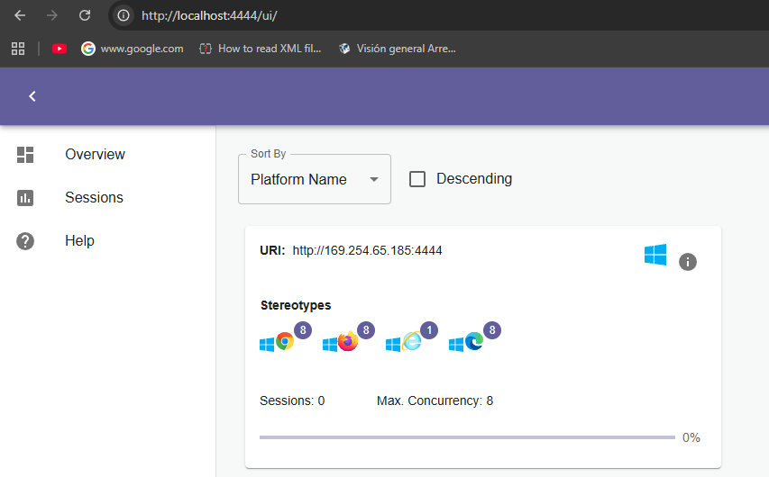
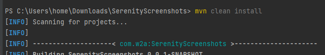

# Serenity BDD y paralelismo
```bash
Aclaración, para iniciar las ejecuciones en paralelo se debe hacer desde la terminal, No en el icono de play en los runner
```
Este proyecto es una plantilla de automatización de pruebas BDD y aprovecha selenium grid para poder realizar ejecuciones en paralelo con serenity bdd

## Derechos
```bash
Autor : jeisson cardenas
Github : https://github.com/testingConGatos
Youtube :  https://www.youtube.com/@testingcongatos
```
🚀 Empezando
Prerrequisitos
Asegúrate de tener instalado lo siguiente:

Java JDK (versión 17 o superior)
Maven (para la gestión del proyecto y sus dependencias)
IntelliJ IDEA

💻 Uso
1. Descargue el archivo jar de Selenium Server (Grid)
   - Selenium Server (Grid)
2. Con la ventana linea de comandos  (cmd) acceda a la ruta donde se ubica el jar descargado anteriormente y ejecute el siguiente comando :
   * java -jar selenium-server-<version>.jar standalone --port 4444
   Al finalizar se debe habilitar la ruta : 
   .
   * Cada que ejecute las pruebas en paralelo se debe tener una consola cmd que active la ruta http://localhost:4444/ui/

3. Ejecutar desde la terminal con el siguiente comando
   * mvn clean install
   Si necesita ejecutar 1 caso de prueba en especifico
   * mvn clean verify -Dtest=<nombre de la clase> test
   .

4. Ejecutar comando para generar evidencias:
   - mvn serenity:aggregate

📂 Estructura del Proyecto
El proyecto sigue una estructura típica de Serenity BDD con Maven:

- src/test/java/runner: Contiene la clase java con la que se ejecutara la prueba.
- src/test/resources/feature: Aquí se encuentran los archivos .feature de Gherkin que describen los escenarios de prueba.
- stepDefinition: Las clases que implementan los pasos de Gherkin (@Given, @When, @Then).
- serenity: El código del modelo de objetos de página (PageObjects) o el modelo de pantalla (Screenplay), según tu implementación.
- src/test/resources/data: El directorio donde se almacenan los archivos .xlsx con los datos de prueba.
- serenity.properties: Archivo de configuración para Serenity BDD.
- pom.xml: El archivo de configuración de Maven.

🧐 Pendientes por implementar
- Manejo de columnas vacias
